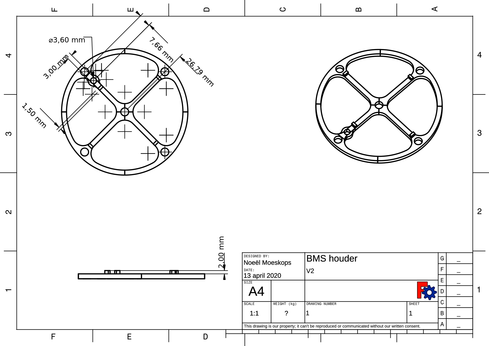
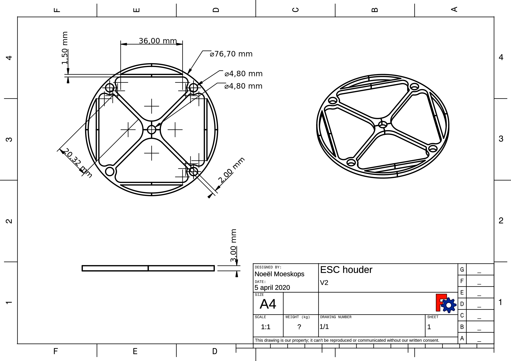
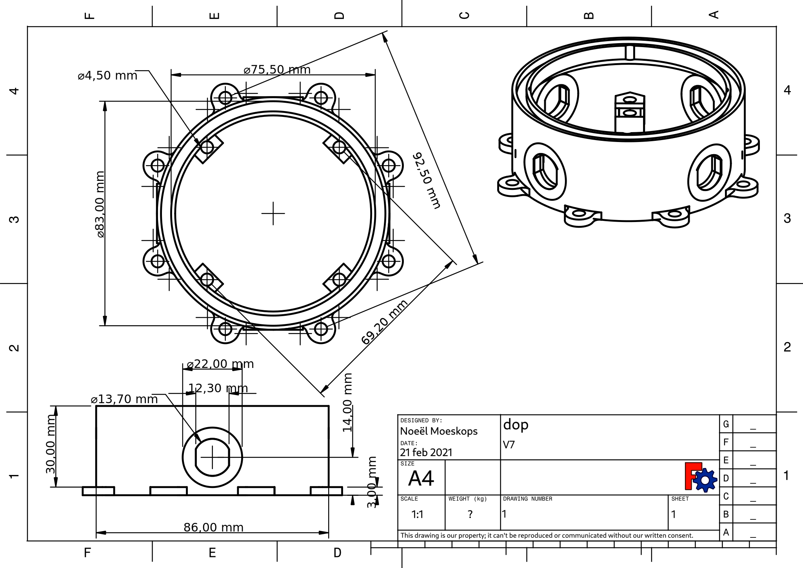

# ROV-CAD-objects
3D CAD objects for (aruna) ROV

All object names are in Dutch.

## batterij houder
hold nine 18650 cells

## bldc
mount "A2212" bldc in 45 or 90 degrees

## esc houder
hold four ESC for bldc motor control.

## schroef
propellor for the A2212 bldc motor. [forked from dreyfusduke](https://www.thingiverse.com/thing:986079)

## universeel houder
outside mount point to connect the bldc motor mount to the base of the ROV.

## water kamer
ballast tank to control Z axis movement.

## BLheli houder
Holds BLheli ESC into place.

## prototype houder
Holds two prototype boards.

## watersensor houder
Holds watersensor.

## dop
Cap with holes for wires.

## PCA9685
Hold PCA9685 breakout bord.

